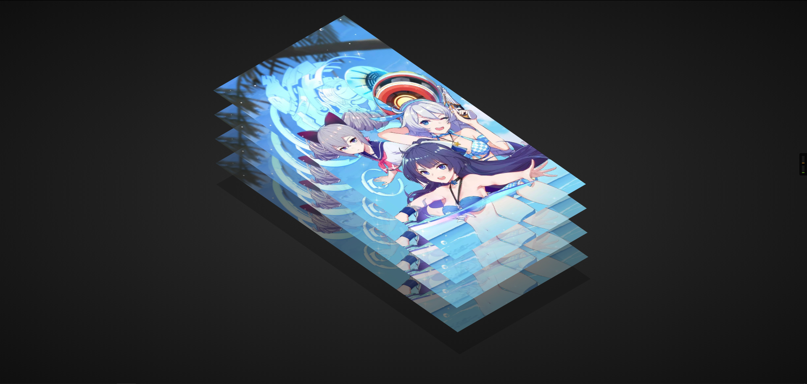

# Layered Image Parallax Effect on Mousemove Using Vanilla Javascript & CSS3

This code is based on [youtube video](https://www.youtube.com/watch?v=OB3oAg4Qrpw&t=2s) by [Online Tutorials](https://www.youtube.com/channel/UCbwXnUipZsLfUckBPsC7Jog). Thanks for share!

[Live Demo](https://yangshun.win/Learn-To-Use/Front-End/CSS-Effect/2019/12/06-Layered-Image-Parallax-Effect/index.html)

