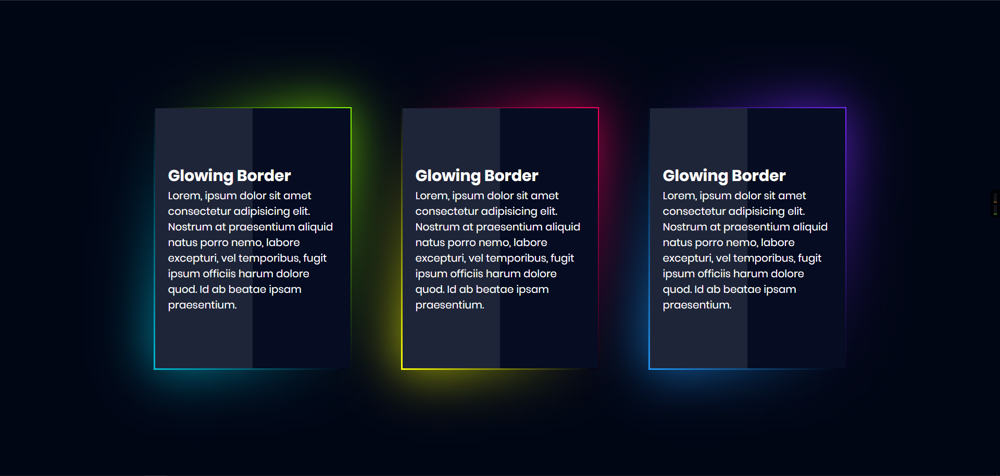

# CSS3 Glowing Gradient Border Card UI Design | Html CSS

This code is based on [youtube video](https://www.youtube.com/watch?v=LYWLE45byXc) by [Online Tutorials](https://www.youtube.com/channel/UCbwXnUipZsLfUckBPsC7Jog). Thanks for share!

[Live Demo](https://yangshun.win/Learn-To-Use/Front-End/CSS-Effect/2019/12/08-Glowing-Gradient-Border-Card-UI-Design/index.html)

