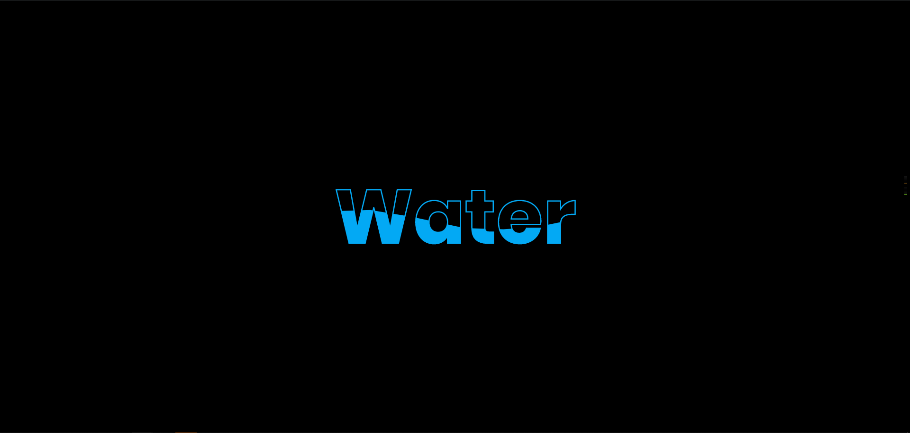

# Pure CSS3 Water Wave Text Animation Effects Using CSS Clip-path

This code is based on [youtube video](https://www.youtube.com/watch?v=Tf6qm5JMUXQ) by [Online Tutorials](https://www.youtube.com/channel/UCbwXnUipZsLfUckBPsC7Jog). Thanks for share!

[Live Demo](https://yangshun.win/Learn-To-Use/Front-End/CSS-Effect/2019/12/09-Water-Wave-Text-Animation-Effects/index.html)

