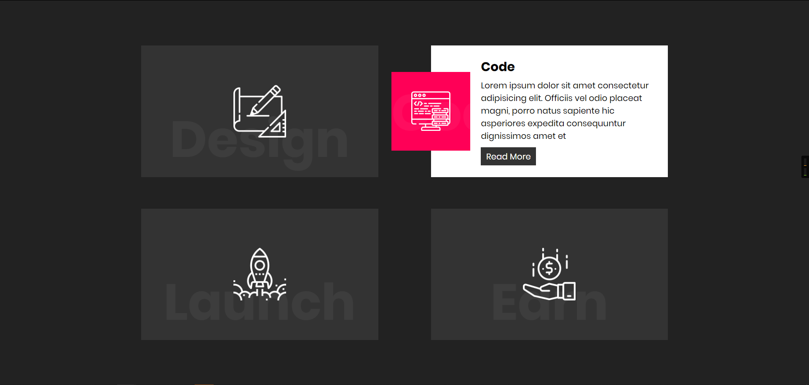

# CSS Responsive Card Hover Effects | Html5 & CSS3

This code is based on [youtube video](https://www.youtube.com/watch?v=Vcay_PG2-DM) by [Online Tutorials](https://www.youtube.com/channel/UCbwXnUipZsLfUckBPsC7Jog). Thanks for share!

[Live Demo](https://yangshun.win/Learn-To-Use/Front-End/CSS-Effect/2019/12/15-Card-Hover-Effects/index.html)

