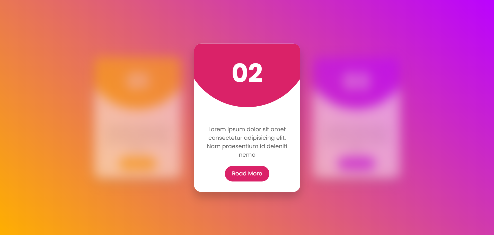

# CSS Responsive CARD UI Design & Hover Effects | Html5 CSS3

This code is based on [youtube video](https://www.youtube.com/watch?v=CYf5grrYgis) by [Online Tutorials](https://www.youtube.com/channel/UCbwXnUipZsLfUckBPsC7Jog). Thanks for share!

[Live Demo](https://yangshun.win/Learn-To-Use/Front-End/CSS-Effect/2020/07/19ResponsiveCARDUIDesign/index.html)

